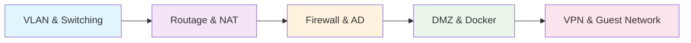

# 🌐 Projets Infrastructure Réseau & Sécurité

> Collection de laboratoires pratiques couvrant l'administration réseau, la sécurité et les services d'infrastructure

---

## 📋 Vue d'ensemble

Cette série de projets démontre la maîtrise complète des technologies réseau modernes, de la commutation de base aux architectures sécurisées d'entreprise. Chaque projet s'appuie sur des outils industriels et des scénarios réalistes.

## 🚀 Projets Réalisés

### 🔗 Projet 1 : Configuration de VLANs et Trunking

**📋 Synthèse**
Ce projet pratique, réalisé avec l'outil de simulation Cisco Packet Tracer, a pour objectif de segmenter un réseau physique en deux réseaux logiques distincts (VLANs). Il démontre comment configurer des ports en mode "accès" pour les appareils finaux et un lien "trunk" (802.1Q) entre deux switches pour permettre la communication des VLANs à travers l'infrastructure.

**🎯 Objectifs du Projet**
- 🔧 Mettre en pratique la segmentation de réseau avec les VLANs
- ⚙️ Configurer des VLANs sur des switches Cisco
- 🔗 Établir un lien trunk pour faire transiter plusieurs VLANs entre deux switches
- 🔒 Vérifier l'isolation des flux entre les différents VLANs

**🛠️ Technologies Clés**
- **Simulation :** 
- **Protocoles et Concepts :** VLAN (Virtual Local Area Network), IEEE 802.1Q (Trunking), TCP/IP, Segmentation réseau

**💡 Compétences Mises en Œuvre**

**🔄 Commutation (Switching) Niveau 2 :**
- 📝 Création et nommage de VLANs sur des commutateurs
- 🔌 Assignation de ports à des VLANs spécifiques (ports d'accès)
- 🌉 Configuration de ports en mode trunk pour l'interconnexion de switches

**📊 Analyse Réseau :**
- 🧪 Utilisation d'outils de simulation pour tester la connectivité et la segmentation
- ✅ Validation du bon fonctionnement de l'isolation : les appareils d'un même VLAN communiquent, tandis que ceux de VLANs différents sont isolés

**📚 Fondamentaux Réseau :**
- 📡 Mise en pratique des concepts de domaine de broadcast et de l'intérêt de la segmentation pour la sécurité et la performance

---

### 🌍 Projet 2 : Routage Statique Inter-LAN et Accès Internet via NAT

**📋 Synthèse**
Ce laboratoire, réalisé sur l'outil de simulation Cisco Packet Tracer, a consisté à interconnecter deux réseaux locaux (LAN) distincts via du routage statique. L'objectif final était de leur fournir un accès partagé à Internet en configurant le service de traduction d'adresses réseau (NAT) sur le routeur de périphérie. Le projet démontre la maîtrise des mécanismes de routage de base et des techniques permettant de connecter un réseau privé à Internet.

**🎯 Objectifs du Projet**
- 🏷️ Configurer des adresses IP sur les appareils de deux réseaux locaux distincts
- 🛤️ Mettre en place des routes statiques pour permettre la communication entre les deux LANs
- 🔄 Configurer le NAT (Network Address Translation) pour permettre aux appareils avec des adresses IP privées d'accéder à Internet
- 📋 Utiliser des listes de contrôle d'accès (ACL) pour définir le trafic éligible à la traduction NAT
- 🧪 Tester la connectivité de bout en bout, à la fois entre les LANs et vers Internet

**🛠️ Technologies Clés**
- **Simulation :** 
- **Routage :** Routage Statique IPv4
- **Protocoles et Concepts :** TCP/IP, NAT (PAT/Overload), Access Control Lists (ACLs), Adressage IP

**💡 Compétences Mises en Œuvre**

**🗺️ Routage (Routing) Niveau 3 :**
- ⚙️ Configuration manuelle de tables de routage sur des routeurs Cisco
- 🧭 Compréhension et utilisation des concepts de réseau de destination et de "next hop" (prochain saut)

**🔄 Translation d'adresses (NAT) :**
- 📦 Implémentation de NAT Overload (PAT) pour économiser les adresses IP publiques
- 📝 Association de listes d'accès (ACLs) pour spécifier précisément quel trafic interne peut être "natté"

**🏗️ Planification d'Adressage IP :**
- 📐 Conception et attribution de plans d'adressage IP pour plusieurs sous-réseaux

**🔧 Dépannage Réseau :**
- 📡 Utilisation de la commande ping pour vérifier la connectivité à chaque étape de la configuration

---

### 🛡️ Projet 3 : Réseau d'Entreprise Sécurisé avec Firewall

**📋 Synthèse**
Ce projet consiste en la conception et le déploiement complet d'un réseau d'entreprise de type LAN. L'infrastructure est sécurisée par un pare-feu pfSense et intègre des services essentiels tels que l'Active Directory pour la gestion centralisée, un serveur web interne, ainsi qu'un serveur proxy pour le filtrage et la sécurisation de l'accès à Internet.

**🎯 Objectifs du Projet**
- 🛡️ Mettre en place un pare-feu pour protéger le réseau local
- 🏢 Centraliser la gestion des utilisateurs et des ordinateurs avec Active Directory
- 🌐 Déployer et sécuriser un serveur web interne (intranet)
- 🔍 Contrôler et filtrer l'accès web des utilisateurs via un proxy
- 📋 Appliquer des politiques de sécurité homogènes via les GPO

**🛠️ Technologies Clés**
- **Pare-feu :** 
- **Système d'exploitation serveur :** 
- **Services :** Active Directory (AD DS), DNS, DHCP, IIS
- **Proxy & Filtrage :** Squid, SquidGuard
- **Sécurité :** SSL/TLS, Antivirus (via proxy)
- **Client :** Windows 10

**💡 Compétences Mises en Œuvre**

**🔧 Administration Système :**
- 💿 Installation et configuration de Windows Server
- 🏢 Déploiement d'un contrôleur de domaine et gestion d'une forêt Active Directory
- ⚙️ Mise en place et gestion des serveurs DNS et DHCP

**🛡️ Sécurité Réseau :**
- 🔥 Configuration d'un pare-feu pfSense avec des interfaces LAN, WAN et DMZ
- 📋 Implémentation de règles de filtrage
- 🔍 Déploiement d'un proxy pour le filtrage d'URL et l'analyse antivirus du trafic web
- 🔒 Sécurisation d'un site web avec un certificat SSL (HTTPS)

**📊 Gestion des Stratégies (GPO) :**
- 📝 Création et application de stratégies de groupe pour renforcer la sécurité et gérer l'environnement utilisateur

**🌐 Services Web :**
- 🖥️ Installation et configuration du rôle IIS (Internet Information Services)
- 🏢 Déploiement d'un site intranet

---

### 🏰 Projet 4 : Sécurisation d'un Réseau avec une DMZ

**📋 Synthèse**
Ce laboratoire porte sur l'ajout d'une zone démilitarisée (DMZ) à un réseau existant pour héberger des services accessibles depuis l'extérieur, comme un serveur web. Le projet couvre l'installation d'un serveur Linux, le déploiement d'une application web avec Docker et la configuration avancée du pare-feu pour isoler la DMZ du réseau interne (LAN) tout en garantissant une haute disponibilité et sécurité.

**🎯 Objectifs du Projet**
- 🔒 Isoler les services publics pour protéger le réseau interne
- 🐳 Déployer une application web conteneurisée avec Docker et NGINX
- 🔄 Configurer un reverse proxy pour acheminer les requêtes externes vers le bon serveur
- 🌐 Mettre en place un serveur DNS autoritaire pour gérer le nom de domaine du service

**🛠️ Technologies Clés**
- **Pare-feu :** 
- **Système d'exploitation :** 
- **Conteneurisation :** 
- **Serveur Web & Reverse Proxy :** , Squid
- **Services DNS :** BIND
- **Sécurité :** HTTPS, Certificats SSL

**💡 Compétences Mises en Œuvre**

**🏗️ Architecture Réseau et Sécurité :**
- 🏛️ Conception et implémentation d'une architecture réseau avec une DMZ
- 🔥 Configuration de règles de pare-feu avancées pour segmenter les réseaux (LAN vs DMZ)
- 🔄 Mise en place de règles de NAT et de Port Forwarding pour exposer un service de manière contrôlée

**🚀 DevOps & Conteneurisation :**
- 🐳 Installation et gestion de Docker sur un serveur Linux
- 📦 Déploiement et gestion de conteneurs NGINX

**🐧 Administration Système (Linux) :**
- 💿 Installation et configuration de base d'un serveur Ubuntu

**🌐 Services Réseau Avancés :**
- 🔄 Configuration d'un reverse proxy pour améliorer la sécurité et la flexibilité
- 🌍 Installation et configuration d'un serveur DNS autoritaire (BIND)
- 🔒 Génération et déploiement de certificats SSL pour sécuriser les communications en HTTPS

---

### 🔐 Projet 5 : VPN et Réseau Invité (Guest LAN)

**📋 Synthèse**
Ce projet est divisé en deux parties critiques pour une entreprise moderne : la mise en place d'un accès distant sécurisé pour les employés via un VPN, et la création d'un réseau Wi-Fi pour les invités, complètement isolé du réseau interne, avec un portail captif pour contrôler l'accès.

**🎯 Objectifs du Projet**
- 👥 Permettre aux employés de se connecter au réseau de l'entreprise de manière sécurisée depuis n'importe où
- 🔒 Créer un réseau séparé et sécurisé pour les visiteurs
- 🚪 Contrôler l'accès au réseau invité via une page d'authentification (portail captif)
- 🛡️ Assurer que les invités ne puissent accéder qu'à Internet, sans aucune visibilité sur le réseau interne

**🛠️ Technologies Clés**
- **VPN :** 
- **Pare-feu & Routage :** 
- **Authentification :** Certificats SSL, Base de données utilisateurs locale
- **Réseau Invité :** Portail Captif (Captive Portal), VLANs (principe d'isolation)

**💡 Compétences Mises en Œuvre**

**🔐 Sécurité des Accès à Distance :**
- ⚙️ Configuration complète d'un serveur OpenVPN sur pfSense
- 🏛️ Création d'une Autorité de Certification (CA) et génération de certificats pour le serveur et les utilisateurs
- 👥 Gestion des utilisateurs et de leurs droits d'accès VPN

**🔒 Segmentation et Sécurité Réseau :**
- 🌐 Création et configuration d'une nouvelle interface réseau virtuelle pour le LAN invité
- 🛡️ Mise en place de règles de pare-feu strictes pour isoler le réseau invité du LAN et de la DMZ

**🚪 Gestion des Accès Invités :**
- 🔐 Implémentation d'un portail captif exigeant une authentification pour l'accès à Internet
- ⚙️ Configuration du service DHCP pour le réseau invité

---

## 🎓 Compétences Techniques Acquises

### 🔧 Infrastructure & Administration
-  Configuration équipements Cisco
-  Administration systèmes Linux
-  Administration Windows Server

### 🛡️ Sécurité Réseau
- Configuration pare-feu multi-zones
- Mise en place de DMZ
- Gestion des accès VPN
- Filtrage et contrôle du trafic

### 🐳 DevOps & Conteneurisation
-  Déploiement d'applications conteneurisées
- Configuration reverse proxy
- Gestion des certificats SSL

### 📊 Services Réseau
- DNS, DHCP, Active Directory
- Services web (IIS, NGINX)
- Proxy et filtrage de contenu

---

## 🛠️ Outils & Environnements

| Catégorie | Outils |
|-----------|--------|
| **Simulation** |  |
| **Virtualisation** |   |
| **Sécurité** |   |
| **Systèmes** |   |

---

## 📈 Progression des Projets



---

## 🔄 Architecture Finale

```
Internet
    │
┌───▼────┐      ┌─────────────┐      ┌──────────────┐
│ pfSense│◄────►│     DMZ     │      │  Guest LAN   │
│Firewall│      │ Web Server  │      │   (WiFi)     │
└───┬────┘      │   (Docker)  │      │              │
    │           └─────────────┘      └──────────────┘
    │
┌───▼────────────────────────────────────────────────┐
│                 LAN Interne                        │
│  ┌─────────────┐  ┌─────────────┐  ┌─────────────┐ │
│  │    AD/DNS   │  │  Web Server │  │   Clients   │ │
│  │    DHCP     │  │    (IIS)    │  │   (Win10)   │ │
│  │   Windows   │  │             │  │             │ │
│  │   Server    │  │             │  │             │ │
│  └─────────────┘  └─────────────┘  └─────────────┘ │
└────────────────────────────────────────────────────┘
         ▲
         │ VPN (OpenVPN)
    ┌────▼────┐
    │ Clients │
    │ Distant │
    └─────────┘
```

---

## 📝 Notes Importantes

> **⚠️ Sécurité :** Tous les projets intègrent des bonnes pratiques de sécurité avec isolation des réseaux, chiffrement et contrôle d'accès.

> **🧪 Environnement :** Projets réalisés en laboratoire avec des outils de simulation et de virtualisation professionnels.

> **📚 Documentation :** Chaque configuration est documentée avec les commandes utilisées et les justifications techniques.

---

## 🤝 Contact & Collaboration

Interested in networking and security projects? Feel free to reach out!

[](your-linkedin-url)
[](your-github-url)
[](mailto:your-email)

---

<div align="center">

**⭐ Si ces projets vous intéressent, n'hésitez pas à donner une étoile ! ⭐**

</div>
